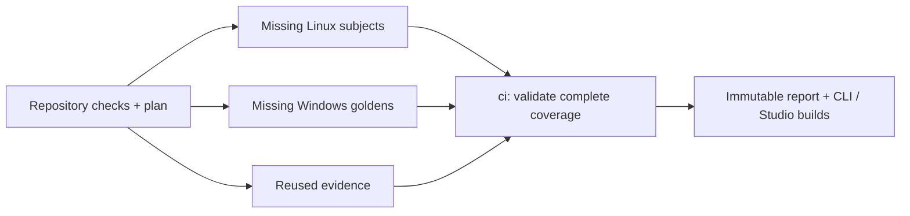

# Architecture

[AGENTS.md](../AGENTS.md) maps each package to what it owns. This document explains how they fit together and the decisions the code does not show.

## Packages

- `packages/core`: Blueprint schema, registry, resolver, generator, and the pure merge used by maintenance. It never touches the file system: `generate` returns a virtual file tree, so the browser and the CLI run the same resolver.
- `packages/integrations`: every integration and add-on, the `recommended` catalog, templates, the golden comparison, and verification evidence.
- `apps/cli`: the `vibestart` command: prompts, flags, `--json`, writing files, running setup, and project maintenance.
- `apps/web`: the Studio, the documentation site, and the generator preview. `oxfmt` has only a native binding, so previews run the generator on the server.
- `golden/`: checked-in generated projects. Each is its own workspace and the expected output of the comparison tests.

## Model

**Kinds and stacks.** The registry declares an ordered list of kinds: `toolchain`, `frontend`, `framework`, `router`, `backend`, `api`, `database`, `orm`, `auth`, `ui`, `desktop`, `runtime`, `deployment`, `testing`. A kind is required or optional and may have a default. A stack maps kind to integration id. An integration lists the `formerIds` earlier releases wrote for it; a blueprint that names one reads as the current id, so existing projects keep upgrading. Kind order fixes the field order of `vibestart.jsonc` and the order in which contributions are collected.

**Blueprint.** `vibestart.jsonc` records `stack`, `addons`, `channel`, and an optional `packageManager`. Its Zod schema and the exported JSON Schema derive from the registry, so a new integration changes no schema.

**Add-ons.** Orthogonal extensions (Knip, Ultracite) are chosen independently of the stack and stay out of the resolver. The registry declares the defaults: omitting `addons` takes them, an explicit `[]` takes none. The CLI flag, the prompt, and the Studio read the same registry.

**App shape is not a kind.** It is a legal pairing of `framework` and `backend`, of which at least one is set:

| `framework`              | `backend` | Shape                                                                                                |
| ------------------------ | --------- | ---------------------------------------------------------------------------------------------------- |
| `spa`                    | `hono`    | Vite proxies `/api` (and `/rpc` with oRPC) in dev; Hono serves the built SPA in production           |
| `spa`                    | none      | A static SPA served by nginx                                                                         |
| `tanstack-start`, `next` | `self`    | The framework's own server                                                                           |
| `tanstack-start`, `next` | `hono`    | Two processes: route handlers forward `/api` and `/rpc` to Hono, so session cookies stay first-party |
| `tanstack-start`, `next` | none      | Server-rendered pages only, with no API or database                                                  |
| none                     | `hono`    | A backend alone, tested by integration tests                                                         |

`self` contributes nothing. It makes "has a backend" a value of the same kind in every shape, and frameworks branch on `ctx.has("self")`.

## Resolver

Integrations declare `provides` and `requires` as capability strings. Four rules:

1. A required kind has a value, and each `kindGroups` group (`framework` and `backend`) has at least one.
2. Every `requires` is provided by some integration in the stack.
3. A capability has at most one provider, so Next.js and TanStack Router (both `router`) exclude each other, as do Hono and `self` (both `http-server`).
4. An `auxiliary` integration exists only to satisfy another's `requires`; a static SPA cannot carry a Node runtime.

Each violation carries a `reason`. The suggested fix is found by enumeration: among all legal stacks, the one that differs from the current stack in the fewest kinds, optionally keeping the kind just changed. Legal stacks number in the hundreds, so enumeration is cheap and no constraint solver is needed.

## Contributions

`contribute(ctx)` returns contributions:

- `file(path, content)` and `renderFile(path, read => content)`: the file belongs to the integration that returns it, and a path claimed twice is an error. `renderFile` runs after all slots are collected and may read any slot.
- `contribute(slot, value)`: appends a value to a slot.

A **slot** is a typed, additive channel defined by whoever owns the target file. Core owns `packageJson` and renders every `package.json` and the workspace file; `vite-plus` owns lint presets, generated-file lists, `AGENTS.md` rows, and the README. An integration never edits another's file, so a new integration changes no existing one. Integrations contribute in kind order, then add-ons in registry order.

Content that varies with the stack inside one owner's file branches on `ctx.has(id)`; it does not become a slot. `ctx.has` throws for an id the registry lacks.

Dependencies are written as names only. A name under the project scope becomes `workspace:*` and any other becomes `catalog:`, with versions from the registry catalog.

Generated code uses the idiom a library documents. When a lint rule misfires on it, the integration that owns the library contributes `lintOverrides` for that library's files, and the generated `vite.config.ts` names the idiom.

## Templates and rendering

- Static files live in `packages/integrations/templates/<owner>/<set>/<output path>`, where the owner is an integration or, for the two testing integrations, `testing`, and are read with `import.meta.glob(..., { query: "?raw" })`. The `common` set always ships; other sets depend on the stack. A template is a file of a project named `my-app`, and the name is replaced on output.
- Files that vary are rendered in TypeScript. A file that differs in one place stays a template, and its owner rewrites that place with an assertion that it matches.
- Templates hold no dot-files, because Vite's glob skips them; those are small and rendered in code.
- Output derived from other files, or stamped with the time of creation, is a `setup` command run after writing: `vp install` writes the lockfile, `vp build apps/web` writes the route tree, `vp run db:generate --name init` writes the first migration. Each command declares the paths it writes, and the golden comparison skips them.
- `generate` ends by formatting every file with the project's own `oxfmt`, so templates and renderers only need correct code.

## Verification

Three gates cover different failure modes:

- **Generation contracts** (`vp test`): generate every canonical stack and check valid paths, ownership, package manifests and setup. Focused tests cover dependency inclusion, framework glue, testing and equivalence.
- **Golden** (`vp test`): all eight `golden/*` projects match generated output byte for byte. They remain the reviewed source baselines; `vp run stacks goldens` updates them. Full per-stack text copies live in CI artifacts instead of Git.
- **Runtime verification**: generate, install, run setup and `vp run ready` inside each affected project. Each passing result identifies its runtime input, resolved lock, platform, image, source run, actual timestamp and full output fingerprint.

The public output fingerprint still covers every generated file, owner and setup command. Runtime identity omits only generated `README.md` and `AGENTS.md` content and file ownership; executable code, MDX, configuration and setup remain inputs. A documentation-only change updates the public output fingerprint while retaining the actual runtime verification date. Code comments are not stripped.

### Equivalence classes

Verification runs once per class of stacks that share a result:

- **Add-ons.** Each stack is verified with the default add-ons. Dropping an add-on removes only its own files, dependencies, presets, and checks (`addons.test.ts`), so the record stands for any subset of the defaults. An add-on that edits business files or the runtime must bring its own coverage.
- **Docker.** A stack without a deployment differs from its Docker sibling by Docker's files alone (`deployment.test.ts`), so it reuses that sibling's record.
- **Bun.** Bun and pnpm generate identical sources and tests, differing in `package.json`, `pnpm-workspace.yaml`, `Dockerfile`, and `vibestart.jsonc` (`bun.test.ts`). A Bun verification therefore checks that a dependency set installs and runs under Bun. A stack reuses the record of the Bun subject whose dependencies include its own: a stack that no other covers (`bun-subject.test.ts` proves the inclusion). A stack counts as verified under Bun only when both its own pnpm record and its subject's Bun record match.

### CI

One workflow handles pull requests (the merge tree), main, manual recovery and weekly fresh verification:

The planner computes runtime inputs and a harness policy digest (runner code, workflow/actions, repository lockfile and tool versions) separately for `ubuntu-24.04` and `windows-2025`, x64. Linux runs at most eight batches with two projects each concurrently; Windows at most two batches with one project at a time. Each Linux batch uses a PostgreSQL 18 service container; Windows prepares PostgreSQL natively. Both prepare Bun and Chromium once. Linux goldens are ordinary Linux subjects, not a second matrix. Every project has an isolated directory and e2e port; tests create their own databases.

`stacks restore` downloads immutable artifacts via explicit run IDs (at most three reports) from recent main runs and same-repository PR runs. Same-repository manual runs follow the same policy; fork evidence is never promoted to shared evidence. API failures, expired artifacts or invalid records cause cache misses. Main computes its own plan after merging; a changed input cannot inherit the PR result. No `pull_request_target` execution, write token, state branch or bot commit is involved.

A runtime result is reusable for seven days only when its platform/input and lock digest match. The lock is retained as an artifact and is used with a frozen install when the runtime changes but dependency inputs do not. Missing dependency locks resolve afresh. Forced and weekly runs resolve afresh and execute every task; successful older results cannot mask a failed fresh task. Runner images are recorded, not assumed immutable; the weekly run detects dependency and hosted-image drift.

Each executor writes a result immediately after a project passes. The report job retains partial evidence even if another task failed. Missing, duplicate or mismatched planned results fail the stable `ci` check; a legitimately empty execution matrix passes through reused results. Cancellation also fails the gate. Reruns reuse completed tasks and execute the remainder. Setup download retries are bounded; test assertions are not retried by the workflow.

Artifacts contain full generated output and output diffs for review, task results, resolved lockfiles, and failed-job logs/traces. They expire after 30 days; missing evidence is regenerated. Contributors commit only source and intentional golden changes.

`stacks check` requires complete matching evidence and writes an ignored build input. CLI and Studio bundles embed that input and retain offline verification displays; development builds without it show unverified. Release CI blocks missing evidence and attaches the report to the GitHub release for durable provenance. The display describes the recorded dependency resolution, not a promise about later installs using version ranges. Cloudflare builds fetch the lightweight `verification-web` export using a read-only build secret and embed it before bundling; browsers never fetch GitHub verification data. Studio prebuilds default add-on previews only, with bounded generation, and directs custom add-on combinations to the CLI.

## Package manager and runtime

`packageManager` defaults to pnpm. Core renders a pnpm workspace file or Bun workspaces with a catalog and install policy in the root manifest; Bun keeps the `catalog:` protocol and approves install scripts only through an explicit `trustedDependencies`.

The `runtime` kind adds Bun beside Node. Bun needs the Hono capability, so it is legal only in stacks with Hono. Full-stack frameworks and the Vite+ toolchain stay on Node, and Docker includes whichever runtimes the stack uses. Stack names gain `bun` for the runtime and `bun-pm` for the package manager, and a record vouches only for its own fingerprint.

Hono splits `src/app.ts` (routing) from `src/index.ts` (listen and shutdown), so both runtimes load the full module graph and answer requests without binding a socket. `stacks smoke` uses that boundary and never writes records.

The e2e runner keeps a parent-owned stdin pipe open, because Vite treats stdin EOF as shutdown outside CI. It installs the catalog's fixed Undici dispatcher and closes it on teardown.

Teardown stops server process trees before removing test databases. Windows uses bounded `taskkill` and exit waits, with direct-child termination if `taskkill` fails; a child that does not exit fails teardown. SQLite removal retries transient file locks.

## Project maintenance

`create` writes `.vibestart/base.json`, a pure snapshot of generator output, and `.vibestart/state.json`, with the identity, choices, project name, ownership, and SHA-256 inventory. Commit both. `.vibestart/.gitignore` keeps local recovery data out; Vite+ formatting and Docker contexts exclude the whole directory.

Commands: `create`, `add`, `upgrade`, `adopt`, `recover`, and the `snapshot` protocol. `add` and `upgrade` reuse the generator, compare the prior baseline, the current files, and the target output, and produce one plan. `packages/core` owns the pure line and JSONC merge, `packages/integrations` declares addable capabilities and the maintained scope, and `apps/cli/src/maintenance` owns release loading, project I/O, commands, and recovery. A capability has one template, shared by create and add.

Only infrastructure is maintained: manifests, catalog, toolchain and config files, Git ignores, agent conventions, Docker files. Starter business source belongs to the user. An upgrade whose target changes existing starter source stops with `requires-migration`; untouched files are never taken as proof of compatibility. Replacing a stack choice is not an automatic migration.

A release is identified by the CLI version and a digest of its normalized input and generated output. `upgrade` uses the running CLI; `--to` runs the exact published target CLI's `snapshot` protocol through npm, then validates identity and choices.

Each mutation takes a project lock, rechecks the reviewed files, persists a backup and journal, and renames files atomically one by one. The operation as a whole is not atomic. Recovery accepts a file at either its recorded before or after content, and rollback refuses newer edits. After files are applied, validation failures let the user fix code without reapplying merges. A changed install input invalidates installation; source-only fixes repeat validation. Installation runs once per unchanged input.

An older project is adopted from an independently preserved snapshot of its exact name and choices (`adopt --from`). `adopt` never infers the old template from modified files, and unknown provenance is a hard stop.

## Decisions

- **Core stays off the file system.** Output is a virtual tree, so preview and CLI agree.
- **Contributions, not AST transforms.** One owner renders each shared file, which is what lets `add` merge correctly.
- **The resolver enumerates and explains.** Every refusal has a `reason` and the smallest fix.
- **Verification is static data.** It ships with the repository, and the CLI shows "Verified" offline.
- **Tests follow risk.** Playwright or TesterArmy e2e covers the main path black-box against a real server and a test database of its own; Vitest integration tests call the API in process against a real database, one database per test file; unit tests go to dense logic; nothing of the project is mocked. The rules ship in each project's `AGENTS.md`.
